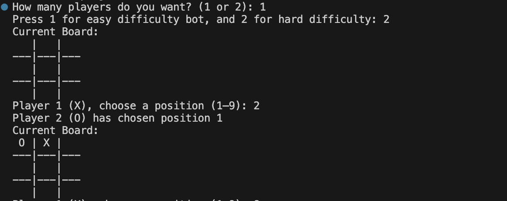

# Tic Tac Toe – CLI Game
A JavaScript command-line Tic Tac Toe game built for Hackathon 

## Project Description
This is a fully interactive **Tic Tac Toe** game played in the terminal using **Node.js**.  
The game allows players to choose between **1-player** or **2-player** mode, displays the board after each move, and checks for win or draw conditions.

The internal board is stored using numbers:

- `-1` = empty  
- `1` = X  
- `0` = O  

A helper function (`translate()`) converts numbers into characters when printing the board.

---

## Installation & Usage

### **1. Clone the repo**
```bash
git clone <git@github.com:sanatehreem1/TicTacToeGame.git>
cd tictactoegame
```
### **2. Install Dependencies**
This game uses prompt-sync for terminal input:
```bash
npm install prompt-sync
```
### **3. Run the Game**
```bash
node script.js
```
### **4. How to Play**
- Enter **1** or **2** for the number of players
- Choose positions **1–9** to place your X or O
- First player to align 3 symbols wins
- If the board fills with no winner → **Draw**

Board layout:
```bash
 1 | 2 | 3
---|---|---
 4 | 5 | 6
---|---|---
 7 | 8 | 9
```

## Technologies
- JavaScript (Node.js)
- prompt-sync (CLI input)
- Terminal 
- Recursion & modular functions

## Process
1. Wrote the pseudocode based on the game logic
2. Designed the board using numeric values
3. Built helper functions:
- ``` initialise() ```
- ``` translate() ```
- ``` writeBoard() ```
- ``` checkWin() ```
- ``` turn() ```
4. Added player turn recursion
5. Tested win, draw, and invalid input cases

## Screenshots

## Wins
1. Working CLI Tic Tac Toe game
2. Successfully used numeric board + translation
3. Built recursive player turn logic
4. Correctly detect draw using ```Math.min(...board)```
5. Pair programmed effectively

## Challenges
1. Preventing overwriting moves
2. Handling invalid input smoothly
3. Correct board indexing

## Bugs
1. 1-player algorithm not implemented yet
2. No "Quit game" option

## Future Features 
1. Computer opponent algorithm
2. Score tracking
3. Restart option
4. Colored board using chalk
5. Improved input handling
6. Deploy as a small web game

## New Feature: 1-Player Mode with Bot Difficulty

This project now includes a **1-player mode** where the user can play against a computer-controlled bot. When selecting 1 player, the game allows you to choose between different difficulty levels:

- **Easy** – Bot chooses a random available move  
- **Medium** – Bot blocks obvious winning moves and makes simple strategic decisions  

This feature expands on the original CLI version and introduces basic AI logic, improving gameplay and making the experience more challenging and dynamic.



## 🤖 Hardest Difficulty: Bot Goes First

We also added a **third difficulty level**, where the bot (O) takes the **first move**.  
This makes the game significantly harder, because the bot opens with an optimal strategy and the player must respond.

### Difficulty Options:
- **Easy (1)** – Bot plays randomly  
- **Hard (2)** – Bot uses blocking + corner strategy  
- **Hardest (3)** – **Bot goes first and uses the hard strategy**

In the hardest level, the bot immediately plays an opening move before the player even begins. This feature adds challenge and variety, making the game more strategic and fun.

